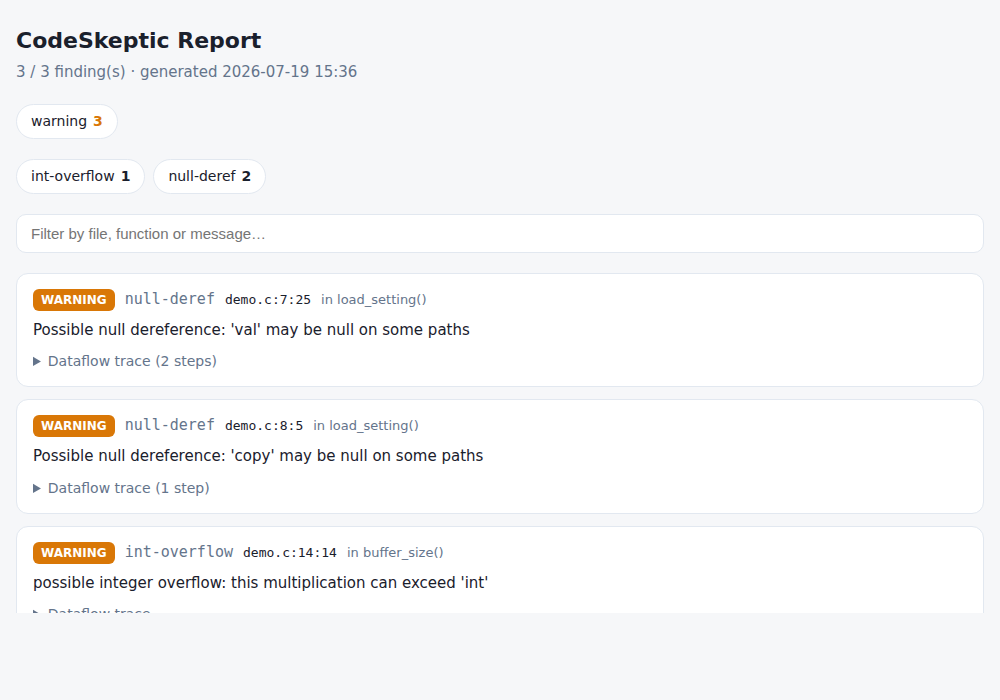
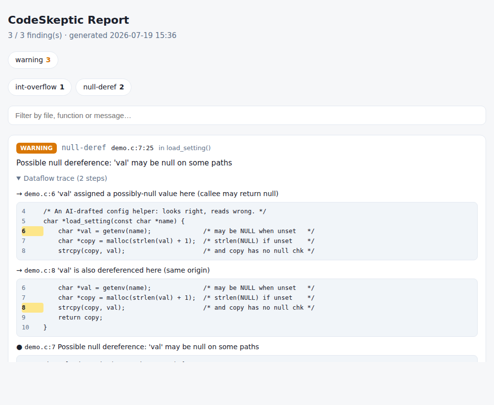
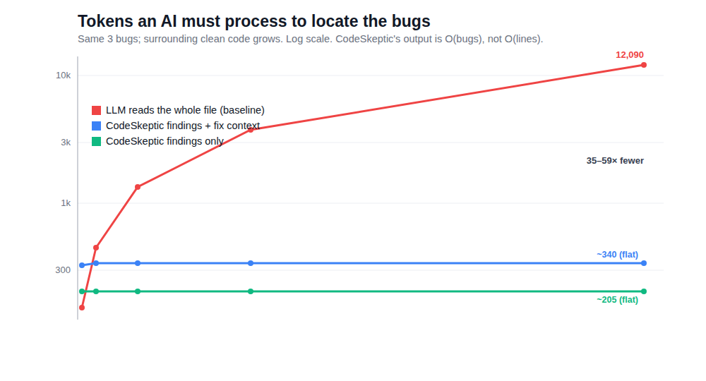

# CodeSkeptic

[](https://github.com/tanzercakir-commits/CodeSkeptic/actions/workflows/ci.yml)

> **Everyone generates. CodeSkeptic verifies.**

A C/C++ static analyzer built on Clang LibTooling, with a reusable
dataflow-analysis engine at its core. CodeSkeptic performs CFG-based
forward dataflow analysis — not just AST pattern matching — so it can
reason about *paths*: what a pointer's state is at a dereference, whether
an allocation is freed on every path, whether a divisor can be zero on
the path that reaches a division.

The long-term goal is a fast, embeddable **semantic verification layer for
AI-assisted development**: an analyzer designed to sit inside the
code-generation loop, re-checking each edit in milliseconds and returning
machine-readable findings with dataflow traces.



Point it at first-draft code and it flags what the compiler waves through
— an unchecked `getenv`, an `atoi` result multiplied past `int`, a work
buffer leaked on an error path. Where a bug spans several lines, the
finding carries a **dataflow trace** with source context:



That is real output on [`docs/demo.c`](docs/demo.c) — and none of it is a
compiler warning. `gcc -O2 -Wall -Wextra -Woverflow` and `clang
-Winteger-overflow` are both silent on that `n * 4096`: `-Woverflow` only
fires on compile-time-*constant* overflow, not a value that arrives from
`atoi` at runtime.

### How does it compare?

Those three findings, run through the mainstream C/C++ tools on
[`docs/demo.c`](docs/demo.c) and [`docs/custom.c`](docs/custom.c). The
interesting part isn't that CodeSkeptic wins a row — it's that **no single
mainstream tool catches all three, and for the two null cases the good
static analyzers disagree with each other**:

| Finding | `-Wall -Wextra` | gcc `-fanalyzer` | clang `--analyze` | CodeSkeptic |
|---------|:---:|:---:|:---:|:---:|
| null-deref via `getenv` (a library contract) | — | — | ✅ | ✅ + trace |
| null-deref via your own null-returning function | — | ✅ | — | ✅ + trace |
| int-overflow from `atoi` | — | — | — | ✅ + trace |

Clang's analyzer models `getenv` as nullable but doesn't follow the
hand-written function; gcc's `-fanalyzer` does the exact opposite; the
everyday `-Wall -Wextra` warnings flag none of them. CodeSkeptic covers
the class — a library-contract source, an interprocedural custom return,
and the runtime overflow — each with a dataflow trace. This isn't
"nobody else can": it's that the everyday warning net has a real gap
here, and analyzer coverage is uneven — which is exactly the surface
CodeSkeptic is built for.

<sub>Reproduced with gcc 13.3 and clang 18.1 on the two files above. MSVC
2022 (`/W4` and `/analyze`) and cppcheck 2.17 (`--enable=all`) were also
checked by hand on the `getenv` case and stayed silent.</sub>

### Cheaper than raw-code AI review (6–59× fewer tokens)

If you already loop an LLM over your diffs to find bugs, CodeSkeptic makes
that loop **cheaper**. An LLM asked to review raw C/C++ must ingest every
line and reason over the paths between them. CodeSkeptic reads the code as
*computation* — outside the token budget — and hands back a compact,
deterministic findings list with a trace. Its output is **O(bugs), not
O(lines)**: flat at ~205 tokens whether the file is 18 lines or 2 400.



| input (same 3 bugs) | LOC  | baseline tokens | CodeSkeptic | saving |
|---------------------|-----:|----------------:|------------:|-------:|
| small file          |  257 |           1 342 |         205 |  6.5×  |
| module              |  737 |           3 725 |         205 | 18.2×  |
| large file          | 2417 |          12 090 |         205 | 59.0×  |

Honest caveat kept: on toy files (<~50 lines) there is **no saving** — the
findings payload costs as much as the source. The crossover is ~50–80 lines;
real review happens well above it, and the saving grows with size. And it is
cheaper *and* more reliable at once — the findings are deterministic with a
verifiable trace, not a probabilistic guess. Full method, numbers, and
limits: [docs/token-ablation.md](docs/token-ablation.md).

## Rules

| Rule | ID | Detects |
|------|----|---------|
| Uninitialized pointer | `uninit-ptr` | Dereference of a pointer that may be unassigned on some path (CFG dataflow) |
| Memory leak | `memory-leak` | Leaks at function exit and reassignment leaks, `malloc`/`calloc`/`strdup`/`free` and `new`/`delete` (CFG dataflow with escape analysis) |
| Double free | `double-free` | Freeing a pointer already in freed state (shares the memory-leak dataflow) |
| Use after free | `use-after-free` | Dereference (`*p`, `p->`, `p[i]`) of a pointer in freed state (shares the memory-leak dataflow) |
| Division by zero | `div-by-zero` | Definite and possible integer division/modulo by zero, with **branch-condition refinement** — `if (z != 0)` guards are understood, so guarded divisions don't produce false positives |
| Null dereference | `null-deref` | Definite and possible dereference of null pointers; tracks `nullptr`/`NULL`/`0` flow with branch-condition refinement (`if (p)`, `if (!p) return`, `p != nullptr`, short-circuit `&&`/`\|\|`); unknown values stay silent, so unguarded parameters don't spam warnings |
| Array/heap bounds | `bounds` | Out-of-bounds access proven whole-range, and copies (`memcpy`/`memmove`/`memset`, `strcpy`/`strcat`/`gets`) past a fixed-size destination (CWE-125/787/120), on an interval + extent lattice |
| Integer overflow | `int-overflow` | Signed multiplication whose proven operand ranges escape the type (CWE-190), including an untrusted source (`int n = atoi(s); n * k`) |
| Contract verification | `contract` | Violations of declared `// cs:` contracts (preconditions, postconditions, ownership effects) — checked by the same dataflow that infers summaries; `contract-syntax` / `contract-unsupported` keep unparseable or unverifiable contracts visible |
| Policy enforcement | `policy` | `cs:policy` pattern prohibitions; v1 ships `no-absolute-paths` (hard-coded absolute path literals) |

**Intrinsic-source recall (v0.3):** the rules above recognize the
library calls whose *contract* makes a defect intrinsic — `malloc`/
`calloc`/`getenv`/`fopen` may return null, `atoi`/`strtol`/`scanf` deliver
unbounded untrusted values, `strcpy`/`strchr` have no bound / dereference
their argument. Keying on the callee's contract (never on caller data)
turns the everyday first-draft shapes an AI writes — `p = malloc(n); *p`,
`x / atoi(s)`, `int n = atoi(s); n * k`, `strchr(getenv(x), ':')` — into
findings, while a downstream guard refines the state and stays silent. On
a blind 24-program AI corpus this lifted combined recall from ~0 (on the
non-alloc classes) to **0.625 at precision 1.000** (zero false positives,
including on 9 deliberately-clean programs).

**Targeted path-sensitivity:** the memory rules keep a small set of
guarded states instead of one merged state, keyed by conditions on
variables that provably don't change (`if (mode == 5) p = malloc(...);
… if (mode == 5) free(p);` is clean — the two guards are correlated,
so the "allocated but never freed" path is infeasible). Function-call
conditions are never keyed (two `check()` calls may differ), mutated
variables are never keyed, and the disjunct budget degrades gracefully
to the classic merged analysis.

**Interprocedural (v1):** functions with visible bodies are summarized
before rules run — return nullness (a `find()`-style function that can
return null makes unguarded dereferences of its result a warning, with
a trace note), return zeroness (a callee that can return zero makes an
unguarded division by the assigned result a warning — the classic
`data = badSource(); 100 / data` split across functions or files) and
parameter effects (free-wrappers count as frees, so double-free/
use-after-free through wrappers is caught; read-only helpers no longer
hide leaks behind them). Recursion-safe fixpoint; external and aliasing
callees stay conservative. |

Example:

```
$ codeskeptic demo.cpp
CodeSkeptic: 2 finding(s)
----------------------------------------
demo.cpp:4:13 [error] use-after-free: Use after free: 'p' is dereferenced after being freed
    -> demo.cpp:2:5 'p' allocated here
    -> demo.cpp:3:5 'p' freed here
demo.cpp:9:12 [warning] div-by-zero: Possible division by zero: 'z' may be zero on some paths
    -> demo.cpp:7:5 'z' assigned zero here
----------------------------------------
```

Findings carry **dataflow traces** — the chain of events that leads to
the bug. Traces appear indented on the console, as a `notes` array in
JSON output, and as `relatedLocations` in SARIF (rendered by GitHub
code scanning).

## Benchmark (NIST Juliet C/C++ 1.3)

Weekly CI runs the analyzer against the [NIST Juliet test
suite](https://samate.nist.gov/SARD/test-suites/112): 400 files per
CWE, sampled evenly across all variant families. A finding in a
function whose name contains `bad` counts as a true positive; in a
`good` function, a false positive. **Rule-matched** columns count only
the rule that targets the CWE under test — that is the precision of
the rule itself. The **all-findings** column includes every rule's
output on the same files (cross-rule noise; tracked separately as
FP-hunting material).

| CWE | Target rule | Rule precision | Recall | Case F1 |
|-----|-------------|---------------:|-------:|--------:|
| CWE-416 Use After Free | `use-after-free` | **1.000** (200 TP / 0 FP) | 0.501 | **0.668** |
| CWE-476 NULL Pointer Dereference | `null-deref` | **1.000** (141 TP / 0 FP) | 0.352 | **0.521** |
| CWE-415 Double Free | `double-free` | **1.000** (95 TP / 0 FP) | 0.241 | 0.388 |
| CWE-401 Memory Leak | `memory-leak` | 0.716 (case-level) | 0.195 | 0.306 |
| CWE-369 Divide by Zero | `div-by-zero` | **1.000** (38 TP / 0 FP) | 0.095 | 0.174 |
| CWE-190 Integer Overflow | `int-overflow` | **1.000** (42 TP / 0 FP*) | 0.010 | 0.020 |

<sub>* CWE-190 precision measured over the full 3080-file corpus (42 TP,
0 FP); the recall figure is the CI-sampled rate. The rand-source family
reaches the sink through a bit-shuffle macro the interval evaluator
cannot fold — a documented known false negative — so the sampled recall
is deliberately low while precision is perfect.</sub>

The journey these numbers took: targeted path-sensitivity
(2026-07-10) cut false positives across rules (memory-leak 92 → 61,
uninit-ptr 178 → 84, cross-file null-deref noise 241 → 129) and
*surfaced previously missed true positives* — correlated-guard double
frees and use-after-frees (+107 TP combined) were false negatives
under merged-path analysis. Cross-TU summaries (`--whole-program`)
connected source/sink flows split across files. Guarded disjuncts v2
(2026-07-12) added call-condition keys, a flow-sensitive fact
lifecycle with constant stamping and entailment, disjunction
elimination for value-materialized asserts, and engine-level
convergence widening — CWE-416 recall rose 0.436 → 0.501 and CWE-401
precision 0.653 → 0.716 in the same step that removed hundreds of
real-world false positives (see the scan table below). A caveat on
cross-rule findings: Juliet `good` functions are only guaranteed free
of the *tested* CWE — e.g. a CWE-416 good function may genuinely
leak, so a `memory-leak` finding there is counted against us while
possibly being correct. The rule-matched columns are the sound
metric.

Beyond precision/hit-rate, the harness reports **case-level F1** (each
file is a case: a matched finding in a `bad` function is a case-TP, in
a `good` function a case-FP, a silent bad file an FN) and a second
operating point restricted to `error`-severity findings. There is
deliberately **no ROC curve**: the analyzer is evidence-based and
binary, not probabilistic — with no sweepable threshold, an AUC from a
two-point "curve" would be misleading. A **score guard**
(`scripts/juliet_expected.txt`) pins per-CWE precision/hit-rate floors;
any code PR that drops below them fails CI.

Notes on reading these numbers honestly:

- **Zero false positives on four of five rules** reflects the design
  choice that unknown values stay silent — the analyzer only speaks
  when the dataflow proves something.
- **Hit rates are lower bounds.** Many Juliet defects flow through
  source/sink call chains and class variants; intraprocedural analysis
  plus v1 summaries catches the local and wrapper-based portion.
  CWE-369's low rate is by design: most Juliet variants there use
  floating-point division (defined behavior in IEEE 754 — deliberately
  not reported) or opaque sources (`rand()`, sockets) that an honest
  analyzer cannot call zero.
- **`memory-leak` is the one noisy rule** (also the bulk of the
  cross-rule noise on other CWEs' files) and is the current
  improvement target.

Results are from the 2026-07-18 run (v0.3); grep `JULIET_RESULT` in the
weekly workflow logs for current numbers. The v0.3 recall series added a
sixth per-CWE floor (CWE-190) and raised div-by-zero recall via untrusted
sources — all six floors hold rprecision 1.000 with zero regressions.
Beyond Juliet, a blind 24-program AI corpus (the design's actual target)
measures combined first-draft recall at 0.625 / precision 1.000.

## Real-world scans

Synthetic benchmarks reward pattern coverage; real codebases punish
every false positive. Each project below was built with its own build
system, analyzed from its compilation database, and every surviving
finding was triaged by hand. All numbers are from one analyzer build
(2026-07-12); the "initial" column is what the same scan reported when
the project was first tried, before the false-positive families it
exposed were fixed.

| Project | Scope | Initial → now | Hand-verified real bugs |
|---------|-------|--------------:|------------------------|
| [systemd](https://github.com/systemd/systemd) | 494 files (basic/core/shared) | 414 → **53** | 3 deliberate leak-shaped idioms, documented |
| [shadPS4](https://github.com/shadps4-emu/shadPS4) | 377 files | 209 → **22** | **3 reported upstream — 2 merged ([#4702](https://github.com/shadps4-emu/shadPS4/pull/4702), [#4703](https://github.com/shadps4-emu/shadPS4/pull/4703))** |
| [libgit2](https://github.com/libgit2/libgit2) | 168 files | 149 → **44** | **11 confirmed OOM-path leaks** (one issue class, report drafted) |
| [llama.cpp](https://github.com/ggml-org/llama.cpp) | full build | 511 → **25** | triage in progress |
| [rtp2httpd](https://github.com/stackia/rtp2httpd) | 27k lines | 4 → **3** | **1 confirmed NULL-contract bug**, report drafted |
| [NASA fprime](https://github.com/nasa/fprime) | 216 files | 10 → **0** | clean (with `--fatal-asserts SwAssert` declaring F´'s assert handler) |
| [abseil-cpp](https://github.com/abseil/abseil-cpp) | LTS tag | 12 → **4** | — |
| [Catch2](https://github.com/catchorg/Catch2) | full build | **0** | clean |

**Confirmed in the wild.** Two of these findings have been fixed and
merged upstream by the shadPS4 maintainers:

- [#4703](https://github.com/shadps4-emu/shadPS4/pull/4703) (closing
  [#4696](https://github.com/shadps4-emu/shadPS4/issues/4696)) —
  `sceSaveDataMount/Mount2` null-checked a pointer with `&&` where it
  needed `||`, so the guard fell through and **dereferenced the very
  pointer it had just checked for null**. The canonical
  looks-right-reads-wrong bug this project exists to catch.
- [#4702](https://github.com/shadps4-emu/shadPS4/pull/4702) (closing
  [#4698](https://github.com/shadps4-emu/shadPS4/issues/4698)) —
  `internal__Foprep` set `ENOMEM` on file-table exhaustion but fell
  through without a `return`, dereferencing the null `FILE*` on the
  next line.

Real bugs, in a real project, found from a compilation database and
accepted by the people who own the code — exactly what each
finding's dataflow trace pointed at.

Two things make these numbers move:

- **Idiom support is configuration, not code**: project allocators
  (`--alloc-functions git__malloc,... --free-functions git__free`),
  fatal assert macros (`--fatal-asserts assert_fail_impl`), and
  cleanup attributes (`_cleanup_free_`, `g_autofree`) are recognized
  so the analysis sees the code the way the project means it.
- **Every false-positive family became an engine feature with a
  pinned test**: pointer-relational validity (systemd's
  `FOREACH_ARRAY`, 235 findings from one root cause),
  cross-variable correlation (flag/status guards, `assert(p || len
  <= 0)` contracts), value-selection rewind (llama's defensive
  ternary macros), escape analysis for macro idioms (`TAKE_PTR`,
  `free_and_replace`, compound literals). The remaining findings per
  project are classified and documented — nothing is hidden behind a
  suppression list.

## Architecture

```
StaticAnalyzer (facade)
 ├─ SourceManager   — LibTooling wrapper: compile_commands.json, AST production
 ├─ RuleEngine      — rule registry, enable/disable, runAll
 │   └─ Rule (abstract) → UninitPointerRule_Ex, MemoryLeakRule_Ex, DivByZeroRule
 │        └─ DataflowEngine — generic worklist solver over the Clang CFG:
 │             Analysis = { State, initialState, merge, transfer,
 │                          onStatement?, refineOnEdge? (assume edges) }
 ├─ Reporter        — ConsoleReporter, JsonReporter
 └─ Config          — CLI args + .codeskeptic.conf
```

Writing a new flow-sensitive rule means defining a lattice (`State`), a
`transfer` function, and optionally `refineOnEdge` to sharpen state along
branch edges. The engine handles CFG construction, the worklist, and
predecessor merges.

## Building

Requires CMake ≥ 3.20, a C++17 compiler, and LLVM/Clang development
libraries (tested with LLVM 18 and 20; LLVM 20 recommended).

### Linux (Ubuntu 24.04)

```bash
sudo apt-get install -y llvm-20-dev libclang-20-dev libzstd-dev zlib1g-dev ninja-build
cmake -B build -G Ninja -DCMAKE_BUILD_TYPE=Release -DCMAKE_PREFIX_PATH=/usr/lib/llvm-20
cmake --build build
ctest --test-dir build        # 52 tests
```

### macOS (Homebrew)

```bash
brew install llvm cmake ninja
cmake -B build -G Ninja -DCMAKE_BUILD_TYPE=Release
cmake --build build
ctest --test-dir build
```

## Usage

```
codeskeptic <source_path> [options]

  --source <path>        Directory/file to analyze
  --build-path <path>    compile_commands.json directory
  --json <file>          JSON output file
  --sarif <file>         SARIF 2.1.0 output file (GitHub code scanning)
  --html <file>          Self-contained HTML report: summary cards double
                         as filters, dataflow traces open with embedded
                         source context, dark/light theme — works offline
  --severity <level>     Minimum severity (info/warning/error)
  --disable-rule <id>    Disable a rule
  --baseline <file>      Suppress findings recorded in the baseline
  --write-baseline <file> Record current findings as the baseline
  --function <names>     Analyze only these functions (comma list,
                         plain or qualified names; repeatable)
  --lines <N-M,K>        Analyze only functions overlapping these line
                         ranges of the analyzed file
  --fatal-asserts <names> Treat these functions as never returning
                         (comma list). For projects whose assert-failure
                         handler deliberately lacks [[noreturn]]: kills
                         the failure path so guarded code stops warning
                         (e.g. --fatal-asserts assert_fail_impl)
  --alloc-functions <names> Treat these functions as heap allocators
                         (comma list). Extends leak/double-free/UAF
                         analysis to project wrappers
                         (e.g. --alloc-functions git__malloc,zmalloc)
  --free-functions <names> Treat these functions as deallocators
                         (their first argument is freed)
  --owning-pointers <names> Treat these class templates as owning smart
                         pointers (comma list). A raw pointer adopted by
                         constructing one is no longer leaked;
                         std::unique_ptr/shared_ptr are built in
                         (e.g. --owning-pointers Ref,RefPtr,scoped_refptr)
  --untrusted-int-sources <names> Treat these functions' return as a
                         full-range untrusted integer (comma list), the
                         same discipline as atoi/strtol. For protocol/parser
                         length fields read off the wire, so downstream
                         length arithmetic that can overflow is reported
                         (e.g. --untrusted-int-sources read_u16,packet_len)
  --report-paths <paths> Report only findings under these path prefixes
                         (comma list). Filters out findings in dependency
                         headers pulled into your TUs; analysis itself is
                         unaffected (e.g. --report-paths $PWD/src)
  --whole-program        Two-pass mode: collect function summaries
                         across all files first, then analyze
  --summary-out <file>   Save harvested cross-file summaries to a file
  --summary-in <file>    Load summaries saved earlier (incremental
                         whole-program: single-file analysis with
                         whole-project knowledge)
  --lang <en|tr>         Diagnostic message language (default: en)
```

Options can also be set in a `.codeskeptic.conf` file (`key=value` lines:
`source_path`, `build_path`, `output_format`, `json_output`,
`sarif_output`, `min_severity`, `enable_rule`, `disable_rule`, `lang`,
`function`, `fatal_asserts`, `alloc_functions`, `free_functions`).

### Suppressing findings

Individual findings can be suppressed with source comments:

```cpp
int x = 1 / z;  // codeskeptic-disable-line
int y = 1 / w;  // codeskeptic-disable-line div-by-zero

// codeskeptic-disable-next-line memory-leak
p = new int(7);
```

A bare marker suppresses every rule on that line; a comma- or
space-separated rule list limits it to those rules. The count of
suppressed findings is reported on stderr.

### Baseline workflow

Adopting the analyzer on an existing codebase without fixing every
legacy finding first:

```bash
codeskeptic src/ --write-baseline .codeskeptic-baseline   # record & exit clean
codeskeptic src/ --baseline .codeskeptic-baseline         # only NEW findings fail
```

Baseline keys are **line-independent**: instead of the line number they
hash the (whitespace-trimmed) text of the finding's source line, so
adding or removing code elsewhere in the file does not invalidate the
baseline. If the flagged line itself changes, the finding resurfaces as
new — deliberately, since a changed line deserves a fresh look.
Identical findings on identical lines are tracked by count, so
baselining one occurrence never hides a second one. Old (v1,
line-numbered) baseline files keep working with their original meaning;
rewrite with `--write-baseline` to migrate.

### Incremental analysis

For edit-check loops (agents, IDEs, pre-commit hooks) analyze only what
changed:

```bash
# re-check just the function you edited (milliseconds)
codeskeptic src/parser.cpp --function Parser::parse

# analyze only the functions actually touched since a git ref:
# the script extracts changed line ranges from diff hunks and passes
# --lines per file, so untouched functions are skipped entirely
scripts/analyze_diff.sh build/src/codeskeptic origin/main --severity error
```

Cross-file knowledge survives incremental runs via summary files:

```bash
# once (or nightly): harvest function summaries from the whole project
codeskeptic src/ --summary-out .codeskeptic-summaries

# then: analyze just the changed file WITH whole-project knowledge —
# e.g. a callee in another file that may return null is still known
codeskeptic src/parser.cpp --summary-in .codeskeptic-summaries

# analyze_diff.sh forwards extra options, so the diff loop composes:
scripts/analyze_diff.sh build/src/codeskeptic origin/main \
    --summary-in .codeskeptic-summaries --severity error
```

The MCP `analyze` tool accepts the same file via its optional
`summaries` argument, so agent loops get cross-file knowledge too.

Stale or malformed summary files are rejected whole (analysis continues
without them, conservatively); conflicting entries merge toward the
weaker claim, so a wrong strong claim cannot enter through the file.

### Semantic regression gate (summary diff)

Summary files are deterministic, so two harvests can be compared as
*contracts*:

```bash
codeskeptic src/ --summary-out before.txt     # e.g. on main
# ... apply the change ...
codeskeptic src/ --summary-out after.txt
codeskeptic --summary-diff before.txt after.txt
```

```
SUMMARY_DIFF WEAKENED find/1 returnNullness: NeverNull -> MaybeNull
[CodeSkeptic] 1 weakened, 0 strengthened, 0 changed, 0 added, 0 removed
[CodeSkeptic] weakened contracts: callers relying on them must be re-checked
```

`WEAKENED` means a strong claim callers may rely on was lost — a
function that could never return null now can, a callee that used to
be read-only now stores its argument. The exit code is `1` in that
case, so the diff doubles as a CI gate: *this change silently altered
function contracts; the callers deserve a look*. Gained claims report
as `STRENGTHENED` (informational), directionless drifts as `CHANGED`,
and signature changes appear as `REMOVED`+`ADDED` (the key includes
arity — an arity change breaks callers anyway).

The gate is configurable for adoption: `--gate warn` (or
`summary_diff_gate = warn` in `.codeskeptic.conf`) keeps the full
report but exits `0`, so a project can watch its contract drift
before letting it break CI. The default stays `error` — and an
unreadable summary file is exit `2` regardless: a gate that cannot
read its input never looks green.

### PR review (diff-native)

`review_diff.sh` turns the analyzer into a PR reviewer: it analyzes the
changed files at BOTH the base revision (in a temporary git worktree,
reusing the head compile commands) and the working tree, and reports the
**delta** — what this change did, not what the codebase already had:

```bash
# in CI, after checking out the PR head:
scripts/review_diff.sh build/src/codeskeptic origin/main --out review.md
```

The markdown review contains:

* **New findings** — introduced by the change, with dataflow traces;
  findings and trace steps that sit on changed lines are marked. A
  finding that merely *shifted* (code added above it) does not
  resurface: matching uses the baseline's line-content keys, and pure
  renames are mapped old→new, so refactor PRs stay quiet.
* **New assumptions** — on by default in review mode: a new inferred,
  unchecked precondition ("parameter `p` is assumed non-null —
  dereferenced, never checked") is exactly the CWE-476 shape reviews
  exist to catch; in the field trial it pinpointed cJSON's #991 null
  dereference as one single finding, and produced zero noise across a
  116-commit history range (the delta bounds the assumption engine's
  volume). Info severity — it informs, and gates only under
  `--strict`. Opt out with `--no-assumptions`.
* **Fixed findings** — present at base, gone at head.
* **Contract changes** — the summary diff of both sides' inferred
  contracts; `WEAKENED` entries gate.
* **Coverage** — what was *not* analyzed and why (headers, deleted
  files, `--exclude` matches, iteration-cap functions). "No warning"
  in an unanalyzed file means *not checked*, and the review says so.

Real-world diffs are noisy in predictable places — test and vendor
directories exercise null paths on purpose. `--exclude 'tests/*'`
(repeatable) skips those changed files *visibly*: they are listed in
the coverage section, never silently dropped.

The exit code is the verdict, on the same evidence ladder as the rules
themselves: **new definite findings (error) and weakened contracts
gate; new "may" findings (warning) are reported but do not** — pass
`--strict` to gate them too, or `--gate warn` to always exit `0` while
still printing the failing verdict (adoption ramp). The last line is
machine-greppable for CI dashboards:

```
REVIEW_RESULT new_errors=1 new_warnings=0 fixed=1 weakened=1 gate=fail
```

Both analyzer runs receive identical settings (arguments after `--` are
forwarded to both — `--alloc-functions`, `--fatal-asserts`, or
`--summary-in .codeskeptic-summaries` to review with whole-project
knowledge, …); a delta between two differently-configured runs would
not be a delta. Known limits, stated rather than hidden: a header-only
change analyzes no TU (it is listed in the coverage section), and
deleted files' base-only findings are not counted as fixed.

A minimal GitHub Actions gate:

```yaml
- uses: actions/checkout@v4
  with: { fetch-depth: 0 }        # the review needs the base commit
- name: Build codeskeptic          # or download a release binary
  run: cmake -B build -G Ninja && cmake --build build
- name: Review the PR diff
  run: |
    scripts/review_diff.sh build/src/codeskeptic \
      "origin/${{ github.base_ref }}" --build-path build \
      --exclude 'tests/*' --out review.md
```

### MCP server (agent integration)

`codeskeptic --serve` runs an MCP (Model Context Protocol) server over
stdio, exposing an `analyze` tool that returns findings — with dataflow
traces — as structured JSON. Agents like Claude Code can call it after
every edit. Register it in `.mcp.json`:

```json
{
  "mcpServers": {
    "codeskeptic": {
      "command": "/path/to/codeskeptic",
      "args": ["--serve"]
    }
  }
}
```

Calling the analyzer is also **cheaper than asking the model to reason over
the raw code** — O(bugs), not O(lines), so an agent spends 6–59× fewer
tokens to locate the memory-safety bugs on a real-sized file, and gets a
deterministic answer with a trace. See [Cheaper than raw-code AI
review](#cheaper-than-raw-code-ai-review-659-fewer-tokens) above for the
measurement and honest caveats.

The `analyze` tool accepts `path` plus optional `build_path`,
`functions` and `lines` — so an agent can scope the re-check to exactly
the functions it just edited — and the project-idiom parameters
(`fatal_asserts`, `alloc_functions`, `free_functions`) so the analysis
sees custom assert handlers and allocator wrappers the same way the
CLI flags do. Idiom registrations are per-call: nothing leaks into the
next request of the long-lived server process.

Exit code is `1` when findings are reported, `0` when clean — suitable
for CI gates.

### Editor & code-scanning integration (via SARIF)

The SARIF 2.1.0 output works today with standard tooling — no plugin of
our own required:

**VS Code.** Install the
[SARIF Viewer](https://marketplace.visualstudio.com/items?itemName=MS-SarifVSCode.sarif-viewer)
extension (Microsoft), then:

```bash
codeskeptic src/ --sarif findings.sarif
code findings.sarif   # or: open via the SARIF Viewer panel
```

Findings appear in a results panel; clicking one jumps to the source
line, and CodeSkeptic's dataflow traces show up as *related locations*
(the allocation/free/null-assignment chain behind each finding is
navigable step by step).

**GitHub code scanning.** Upload the same file from CI and findings
appear in the repository's Security tab and as PR annotations. A complete
workflow — build CodeSkeptic, generate your project's compilation
database, analyze, upload:

```yaml
# .github/workflows/codeskeptic.yml
name: CodeSkeptic
on: [push, pull_request]

permissions:
  contents: read
  security-events: write        # required to upload SARIF to code scanning

jobs:
  analyze:
    runs-on: ubuntu-latest
    steps:
      - uses: actions/checkout@v4

      - name: Build CodeSkeptic
        run: |
          sudo apt-get update
          sudo apt-get install -y llvm-18-dev libclang-18-dev cmake
          cmake -B cs-build -DCMAKE_BUILD_TYPE=Release
          cmake --build cs-build -j

      - name: Generate your project's compile_commands.json
        run: cmake -B build -DCMAKE_EXPORT_COMPILE_COMMANDS=ON

      - name: Analyze -> SARIF
        run: ./cs-build/src/codeskeptic . --build-path build --sarif codeskeptic.sarif || true

      - uses: github/codeql-action/upload-sarif@v3
        with:
          sarif_file: codeskeptic.sarif
```

(`|| true` because CodeSkeptic exits 1 on findings; code scanning does
its own gating.)

For a shareable, tool-free view of the same findings, use `--html` —
one self-contained file with filters and source-context traces.

## Contracts (`cs:`)

CodeSkeptic's rules infer what a function does. Contracts pin what it
is SUPPOSED to do — a contract is a **declared function summary**,
written as a structured comment and checked by the same dataflow that
does the inference:

```c
// cs: requires p != null
// cs: ensures return != null if n != 0
// cs: owns(cfg)
char *find_config(struct Cfg *cfg, const char *p, int n);
```

When AI-generated (or human) code later breaks the promise, the diff
between declared and actual behavior is a finding at the exact line
that broke it.

What is enforced today:

- `requires p != null` / `requires n != 0` — **assume/guarantee**:
  inside the callee the parameter is trusted (the contract carries the
  proof burden); every visible call site is checked against the
  caller's own dataflow state. `f(NULL)` into a non-null contract is
  an error, a possibly-null argument is a warning, a guarded argument
  is silent. Relational escapes (`requires p != null || n <= 0`) are
  honored.
- `ensures return != null` / `!= 0` — checked against the inferred
  return summaries; the guarded form (`... if n != 0`) is checked
  per path at every return statement, and the violating return
  carries a dataflow trace.
- `owns(p)` / `borrows(p)` — checked against the inferred parameter
  effects: `owns` with a provably read-only body and `borrows` with a
  freeing body are violations (leak and double-free shapes).
- `cs:policy no-absolute-paths` — AST-level pattern prohibition: a
  hard-coded absolute path in a string literal is an error. Activate
  per file with the comment, or project-wide via `policy =
  no-absolute-paths` in `.codeskeptic.conf` (or `--policy`).

Failure semantics are deliberate: a violated bare `cs:` contract is an
**error** (CI fails — that friction is the point; changing the `cs:`
line in review IS the audit trail of changed intent). `cs:ai` marks a
machine-proposed contract: same grammar, violations downgrade to
warnings — tools propose, humans adopt by deleting three characters.
Unparseable lines are `contract-syntax` errors and anything outside
the checkable subset is an explicit `contract-unsupported` warning —
a contract is never silently accepted.

For third-party code you cannot annotate, contracts live in a sidecar
file (`src/core.c` → `src/core.c.csk`), every entry explicitly
anchored to its function (`git_commit_create: requires repo != null`,
optional `/arity` for overloads). Position-based mapping is forbidden
by design: a silently shifted mapping would attach guarantees to the
wrong functions.

The full design (grammar, checkable subset, failure semantics,
rationale) is in [`CONTRACTS.md`](CONTRACTS.md).

## Roadmap

See [`ROADMAP.md`](ROADMAP.md) for the full
assessment and phased roadmap: SARIF output, suppression/baseline
support, benchmark-driven precision measurement, incremental analysis,
and MCP-server mode for agent integration.

## License

Apache License 2.0 — see [LICENSE](LICENSE).

Apache License 2.0 — see [LICENSE](LICENSE).
